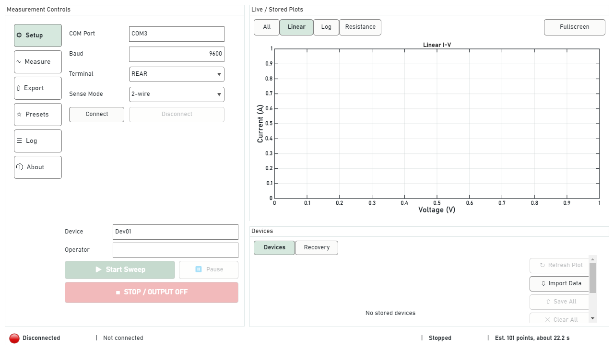
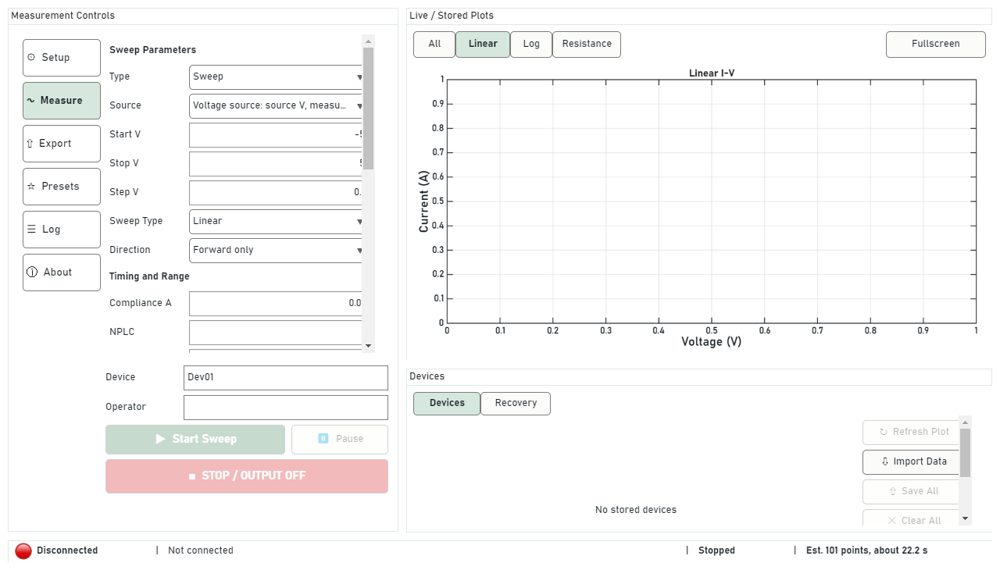
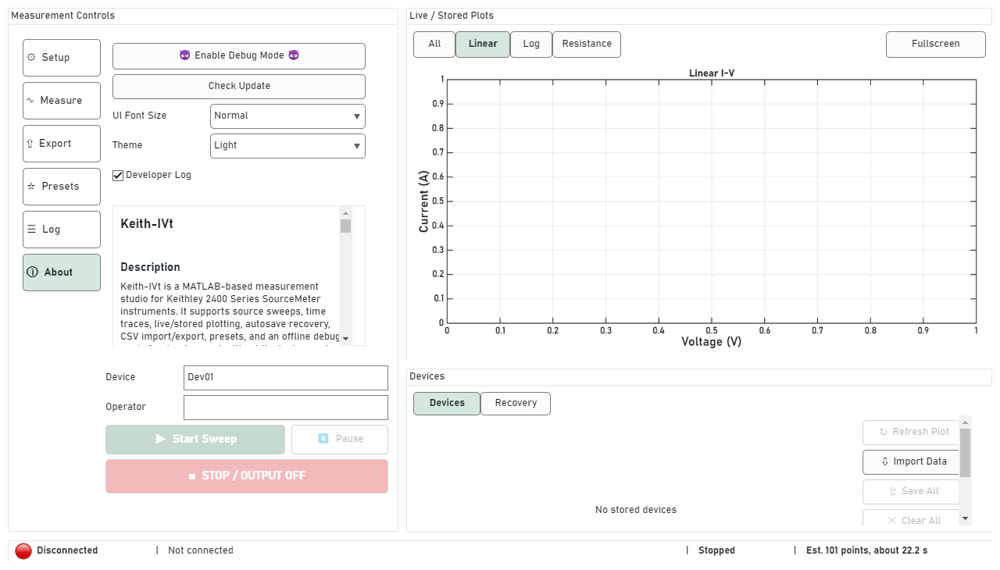

# Keith-IVt

Keith-IVt is a MATLAB desktop app for Keithley 2400 Series SourceMeter measurements. It supports source sweeps, time traces, live and stored plotting, CSV import/export, autosave recovery, presets, and an offline debug mode for development without an attached instrument.

The current release target is `0.3.0 beta`.

Repository: <https://github.com/Xiaolong-6/Keith-IVt>

Release page: <https://github.com/Xiaolong-6/Keith-IVt/releases>

## Screenshots

Setup and live plot area:



Measurement controls:



About and settings page:



## License

Keith-IVt is released under the MIT License. See `LICENSE`.

## Documentation

- [Architecture notes](docs/ARCHITECTURE.md)
- [Roadmap](docs/ROADMAP.md)
- [Packaging notes](docs/PACKAGING.md)
- [Release checklist](docs/RELEASE_CHECKLIST.md)
- [Release verification record](docs/RELEASE_VERIFICATION_2026-05-11.md)

## Prerequisites

- MATLAB with `uifigure`, `serialport`, and `serialportlist` support.
- Tested with MATLAB R2025b on Windows.
- A Keithley 2400 Series SourceMeter for hardware measurements.
- A working serial/USB serial connection that appears as a COM port, such as `COM3` on Windows.
- The operating-system driver for the serial adapter or USB-to-serial cable, if one is needed.
- Matching Keithley serial settings in the app and on the instrument. The release checks used `9600` baud.

Debug mode can be used without hardware or a serial driver. Real hardware mode requires MATLAB to be able to list and open the instrument port with `serialportlist('available')` and `serialport(...)`.

The public beta hardware gate was verified with:

- Instrument: Keithley 2401
- Port: `COM3`
- Baud rate: `9600`
- Terminal setting: `REAR`

Other Keithley 2400 Series models should be confirmed with the hardware checks before release use.

## Launch

Open MATLAB in this project folder and run:

```matlab
START_Keith_IVt
```

The launcher creates the app from `+ui/IVStudioApp.m`.

## Hardware Check

Before using a real device for measurement, connect the Keithley in safe open-circuit, low-current conditions and run:

```matlab
addpath('hardware_checks');
results = run_hardware_checks("COM3", 9600, "REAR");
```

Change the port, baud rate, and terminal setting to match your setup.

## Basic Workflow

1. Choose connection settings on the Setup page.
2. Enable Debug Device for offline development, or connect to a real Keithley.
3. Configure Sweep or Time Trace measurement settings.
4. Set Device and Operator metadata.
5. Start the run, then review data in Devices and plots.
6. Export selected data or save all devices when finished.

## Safety Notes

- Start with conservative compliance or limit values.
- Verify front/rear terminal selection before enabling output.
- Verify 2-wire or 4-wire sense mode before measuring.
- Use Stop/Output Off after errors, aborts, or completed runs when working with real hardware.

## Data And Recovery

- Presets are stored in `config/presets.mat`.
- Autosave and recovery files are stored in `cache/`.
- Exported CSV files include visible metadata for measurement type, operator, source mode, sense mode, terminal, instrument, timing, range, and compliance settings.
- Older files that used `Comment` metadata remain import-compatible.

## Runtime Data Directory

The Windows Runtime package stores runtime data (cache, logs, presets, and default exports) under:

```text
%APPDATA%/Keith-IVt
```

This keeps user data separate from the application install folder.

## Development Checks

Run non-hardware checks from the project folder:

```matlab
addpath('dev_checks');
run_all_checks
```

Run hardware checks only with a real instrument connected safely in open-circuit, low-current conditions:

```matlab
addpath('hardware_checks');
results = run_hardware_checks("COM3", 9600, "REAR");
```

## Known Limitations

- Hardware smoke checks have been run on a Keithley 2401. Other models and serial adapters should be verified before release use.
- A Windows Runtime package has been built and smoke-tested on the build machine. Runtime startup can take tens of seconds because MATLAB Runtime initializes the JVM/uifigure stack.
- Instrument profiles are detected, but UI limits are not yet fully clamped by the detected model.
